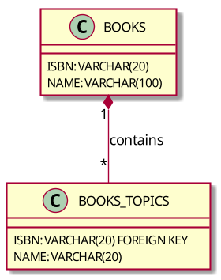

# Getting Started With the Exasol Document Mapping Language (EDML)

For creating a Virtual Schema for document data you have to define a mapping from the document structure to a relational structure. This is done using the Exasol Document Mapping Language (EDML)
([reference](https://schemas.exasol.com/#exasol-document-mapping-language-edml)).

Usually you write these definitions by hand. An exception are parquet input files for which you can use the [Exasol Parquet EDML generator](https://github.com/exasol/parquet-edml-generator/) to create an initial version that you then can customize further.

We recommend using an editor with JSON-Schema support for creating the files. This makes it easier to write the definition.

You can then use this mapping definition when creating the virtual schema. For that you upload the mapping definition as a file to BucketFS. Afterwards you set the property `MAPPING` in the `CREATE VIRTUAL SCHEMA` command to the path of the mapping definition in BucketFS.

You can also upload multiple mapping definitions into one folder and point to this folder. The adapter will then pick up all definitions.

For testing and automated creation of Virtual Schemas it's also possible to inline the EDML definition into the `MAPPING` property. Our tip: Don't use this if you're manipulating the EDML definitions by hand. Instead, use a proper editor with JSON-Schema support and upload the files. Editing inlined files is just too confusing. To inline the definitions you simply provide the mapping definition instead of the BucketFS path:

```
MAPPING = '{ "$schema": ... }'
```

If you want to provide multiple mapping definitions inline you can use a JSON array:

```
MAPPING = '[{ "$schema": ... }, { "$schema": ... }]'
```

This guide explains how to define EDML mappings in general. For data source specifics, check the corresponding virtual schema. Different data sources use different data formats. In this guide we use JSON.

For mapping multiple document sets, you can create multiple files, upload them to a folder and BucketFS and reference this folder.

The structure of the mapping follows the structure of the document data.

## Simple Example

Given the following JSON document:

```json
{
  "isbn": "1763413749",
  "name": "Accessing NoSQL-Databases in Exasol using Virtual Schemas",
  "author": {
    "name": "Jakob Braun"
  }
}
```

We want to map documents like that to an Exasol table with the following structure:

```sql
CREATE TABLE BOOKS (
    ISBN        VARCHAR(20),
    NAME        VARCHAR(100),
    AUTHOR_NAME VARCHAR(20)
);
```

The nested property `author.name` is mapped to the column `AUTHOR_NAME`.

In order to let this adapter create the described mapping we create the following mapping definition:

```json
{
  "$schema": "https://schemas.exasol.com/edml-1.5.0.json",
  "source": "<data source specific source description>",
  "destinationTable": "BOOKS",
  "description": "Example mapping",
  "mapping": {
    "fields": {
      "isbn": {
        "toVarcharMapping": {
          "varcharColumnSize": 20,
          "description": "The isbn is mapped to a string with max length of 20",
          "overflowBehaviour": "ABORT",
          "required": true
        }
      },
      "name": {
        "toVarcharMapping": {
          "varcharColumnSize": 100,
          "description": "The name is mapped to a string with max length of 100",
          "overflowBehaviour": "TRUNCATE"
        }
      },
      "author": {
        "fields": {
          "name": {
            "toVarcharMapping": {
              "varcharColumnSize": 20,
              "destinationName": "AUTHOR_NAME",
              "description": "Maps the nested property authors.name to column AUTHOR_NAME"
            }
          }
        }
      }
    }
  }
}
```

The `source` property describes the source of the data. Its syntax and meaning is different for the different Virtual Schemas for different data sources.

Check the corresponding user guide for details.

Next we save this definition to a file, upload it to a bucket in BucketFS and reference it in the `CREATE VIRTUAL SCHEMA` call.

After running [creating a virtual schema](../../README.md) (for example with the schema named `BOOKSHOP`) we can query the table using:

```
SELECT * FROM BOOKSHOP.BOOKS;
```

## Example of `toJsonMapping`

Document data can contain nested lists. Consider for example the following document:

```json
{
  "isbn": "1763413749",
  "name": "Accessing NoSQL-Databases in Exasol using Virtual Schemas",
  "topics": [
    "DynamoDB",
    "Exasol"
  ]
}
```

We want to map such documents to an Exasol table in the following way:

```sql
CREATE TABLE BOOKS (
    ISBN        VARCHAR(20),
    NAME        VARCHAR(100),
    TOPICS      VARCHAR(200)
);
```

Where `TOPICS` is a `VARCHAR` column containing JSON strings like `["DynamoDB", "Exasol"]`.

To achieve this we create the following mapping definition:

```json
{
  "$schema": "https://schemas.exasol.com/edml-1.5.0.json",
  "source": "<data source specific source description>",
  "destinationTable": "BOOKS",
  "description": "Example mapping",
  "mapping": {
    "fields": {
      "isbn": {
        "toVarcharMapping": {
          "varcharColumnSize": 20,
          "overflowBehaviour": "ABORT"
        }
      },
      "name": {
        "toVarcharMapping": {
          "varcharColumnSize": 100,
          "overflowBehaviour": "TRUNCATE"
        }
      },
      "topics": {
        "toJsonMapping": {
          "description": "Maps the sub document of this property to a JSON string",
          "varcharColumnSize": 200
        }
      }
    }
  }
}
```

The toJsonMapping will map the nested document `topics` to a JSON string in a `TOPICS` column.

## Example of `toTableMapping`

We again want to map the document with a nested list. But this time we want to map the nested list to a second table that references the original one using a foreign key.

```json
{
  "isbn": "1763413749",
  "name": "Accessing NoSQL-Databases in Exasol using Virtual Schemas",
  "topics": [
    "DynamoDB",
    "Exasol"
  ]
}
```

In addition we know that `isbn` is a unique property (for example since it is a primary key in the data source).

We want to map such documents to the following relational structure:



Note that `BOOKS_TOPICS` uses `ISBN` as FOREIGN KEY.

To achieve this we create the following mapping definition:

```json
{
  "$schema": "https://schemas.exasol.com/edml-1.5.0.json",
  "source": "<data source specific source description>",
  "destinationTable": "BOOKS",
  "description": "Example mapping",
  "mapping": {
    "fields": {
      "isbn": {
        "toVarcharMapping": {
          "varcharColumnSize": 20,
          "overflowBehaviour": "ABORT",
          "key": "global"
        }
      },
      "name": {
        "toVarcharMapping": {
          "varcharColumnSize": 100,
          "overflowBehaviour": "TRUNCATE"
        }
      },
      "topics": {
        "toTableMapping": {
          "mapping": {
            "toVarcharMapping": {
              "destinationName": "NAME"
            }
          }
        }
      }
    }
  }
}
```

The Virtual Schema adapter automatically adds a foreign key to the table. In the example above, it adds the column `BOOKS_ISBN` to the `BOOKS_TOPICS` table. It did pick the `ISBN` column, because we marked it as a key column.

### Key Types

There are two different key types: `global` and `local`. The difference only plays a role when mapping multi level nested lists.

Consider the following example:
A book contains multiple chapters and a chapter again can contain multiple figures. If in that example a chapter has a global key, that means, it is unique over all existing chapters (also across books). If it defines a local key, it is only unique over all chapters of that book.

### Autogenerated Keys

If the data source supports it, the virtual schema adapter can also fetch the keys from the data source. In that case, the adapter will use a column as foreign key that is a unique key in the data source.

If you did not mark any column as key and the adapter could not detects any key column, it will add an `INDEX` column. These columns contain the position of the element in the nested list. So in the example from above `DynamoDB` will receive the index 0 and `Exasol` the index 1.

## Source Reference Column

Some dialects support reading one table from multiple sources. For example the [files-virtual-schemas](https://github.com/exasol/virtual-schema-common-document-files) allow you to load each row from a different file. In that case you may want to add the filename as a column to the Exasol table. That allows you to query on it and by that only read the required files.

To do so, set `addSourceReferenceColumn: true` in the root object of your EDML definition. The adapter will then automatically add a column named `SOURCE_REFERENCE` to the end of the table.

You can use this property for all dialects. Typically, it will, however, only give you additional information, if you load data from multiple sources.

The `SOURCE_REFERENCE` column has a maximum size of 2000 characters. The adapter will throw an exception when a source reference exceeds this.

## Supported Conversion

This adapter can convert input data to the requested column type. For example if the input is a number and the requested column is a string the adapter can convert the number to string.

The conversion is done per value. That means that it's ok if in one row the input value is an int-value and the next row is a bool value. The adapter can convert both to the requested output column.

That's, however, not always the best option. For that reason, you can configure how the adapter should behave if the input data does not match the requested column format. You can configure this for example using the `nonStringBehaviour`:

* `ABORT`: Abort the whole query with an exception
* `NULL`: Return `NULL` instead
* `CONVERT_OR_ABORT` try to convert and abort the query if not convertable
* `CONVERT_OR_NULL` try to convert and return `NULL` if not convertable

All mappings pass through null values. That means, if the source value is a null-value, the adapter converts it to `NULL`. The only exception is the `toJsonMapping` which converts null values to JSON null values.

### ToVarcharMapping Conversions

* Nested object: Not convertable
* Nested list: Not convertable
* String: No conversion needed
* Decimal value: String representation of decimal (e.g: `"1.23"`)
* Double value: String representation of decimal (e.g: `"1.23"`)
* Boolean value: `"true"` or `"false"`
* Binary data: Converted to Base64 encoded data string
* Date: Date as string (e.g: `"2021-09-27"`)
* Timestamp: Timestamp as UTC timestamp (e.g: `"2021-09-21T08:18:38Z"`)

### ToDecimalMapping Conversions

* Nested object: Not convertable
* Nested list: Not convertable
* String: The adapter tries to parse the string as a number. E.g: `"1.23"` -> `1.23`. If not possible (e.g: `"abc"`) the adapter handles the value as not convertable.
* Decimal value: No conversion needed
* Double value: Converted to decimal
* Boolean value: `true` -> 1, `false` -> 0
* Binary data: Not convertable
* Date: Date as UTC milliseconds time value
* Timestamp: Timestamp as UTC timestamp in milliseconds (floored)

### ToDoubleMapping Conversions

* Nested object: Not convertable
* Nested list: Not convertable
* String: The adapter tries to parse the string as a number. E.g: `"1.23"` -> `1.23`. If not possible (e.g: `"abc"`) the adapter handles the value as not convertable.
* Decimal value: Converted to floating-point.
* Double value: No conversion needed
* Boolean value: `true` -> 1, `false` -> 0
* Binary data: Not convertable
* Date: Date as UTC milliseconds time value
* Timestamp: Timestamp as UTC timestamp in milliseconds (floored)

### ToDateMapping Conversions

* Nested object: Not convertable
* Nested list: Not convertable
* String: Not convertable
* Decimal value: Interpreted as UTC timestamp in milliseconds
* Double value: Interpreted as UTC timestamp in milliseconds
* Boolean value: Not convertable
* Binary data: Not convertable
* Date: No conversion needed
* Timestamp: Converted to date (looses time information)

### ToTimestampMapping Conversions

* Nested object: Not convertable
* Nested list: Not convertable
* String: Not convertable
* Decimal value: Interpreted as UTC timestamp in milliseconds
* Double value: Interpreted as UTC timestamp in milliseconds
* Boolean value: Not convertable
* Binary data: Not convertable
* Date: Converted to timestamp
* Timestamp: No conversion needed

### ToJsonMapping Conversions

The `toJsonMapping` always converts the input value to a JSON string. For that reason there is no property like `nonStringBehaviour`.

* Nested object: Converted to JSON string
* Nested list: Converted to JSON string
* String: Converted to JSON string
* Decimal value: Converted to JSON number
* Double value: Converted to JSON number
* Boolean value: Converted to JSON boolean
* Binary data: Converted to JSON string with Base64 encoded data
* Date: Date as JSON string (e.g: `"2021-09-27"`)
* Timestamp: Timestamp as UTC timestamp (e.g: `"2021-09-21T08:18:38Z"`)

## Automatic Mapping Inference

The adapter supports automatic mapping inference. This allows you to omit the `mapping` element from the EDML definition. The virtual schema will then infer the mapping from the schema of the source.

Currently this is only supported for Parquet files using the [file based virtual schemas](https://github.com/exasol/virtual-schema-common-document-files).

### Notes

* The files specified in the `source` must be available when creating the virtual schema. If the files are not available, the `CREATE VIRTUAL SCHEMA` command will fail.
  * When you don't use automatic mapping inference (i.e. you specify the `mapping` element) you can still create the virtual schema as before without `source` files being available.
* The adapter will detect the mapping based on the schema of the first file. Please make sure that all files specified as `source` are using the same schema, else the mapping may be wrong.
* The adapter will detect the mapping when the virtual schema is created. If the schema of the `source` files changes, please drop and re-create the virtual schema to run the auto-inference again.
* Creating the virtual schema will take longer because the adapter needs to read files from the `source`.

## CSV Support
### CSV File Headers

For CSV files VSD provides the optional JSON object `additionalConfiguration`. In this object you can set `csv-headers` to `true` if the CSV file(s) has headers. If the CSV file(s) doesn't have headers you can omit this whole block (or set `csv-headers` to `false`).

Example:
```json
{
  "$schema": "https://schemas.exasol.com/edml-1.5.0.json",
  "source": "data/CsvWithHeaders.csv",
  "destinationTable": "BOOKS",
  "description": "Maps MY_BOOKS to BOOKS",
  "addSourceReferenceColumn": true,
  "additionalConfiguration": {
    "csv-headers": true
  },
  "mapping": {
    "fields": {
      "id": {
        "toVarcharMapping": {
          "destinationName": "ID"
        }
      }
    }
  }
}
```

### Mapping CSV Files

When you want to map CSV files with headers you use the column name from the CSV header.

The following example maps the column with header "id" to "ID":
```json
  "mapping": {
    "fields": {
      "id": {
        "toVarcharMapping": {
          "destinationName": "ID"
        }
      }
    }
  }
```

When you want to map CSV files without any headers then you should use the index of the columns (zero-based, so start counting at 0).

The following example maps column 0 to "ID":
```json
  "mapping": {
    "fields": {
      "0": {
        "toVarcharMapping": {
          "destinationName": "ID"
        }
      }
    }
  }
```

Currently `"toVarcharMapping"` is the only available mapping option for CVS files.
Please use Exasol database methods `CONVERT`, `CAST`, etc. to convert from VARCHAR to other data types such as `DATE` or `DECIMAL`.

Example:
```sql
SELECT CONVERT( BOOLEAN, BOOLEANCOLUMN ) CONVERTEDBOOLEAN FROM TEST_SCHEMA.DATA_TYPES;
```

## Reference

* [Schema mapping language schema & reference](https://schemas.exasol.com/#exasol-document-mapping-language-edml)
